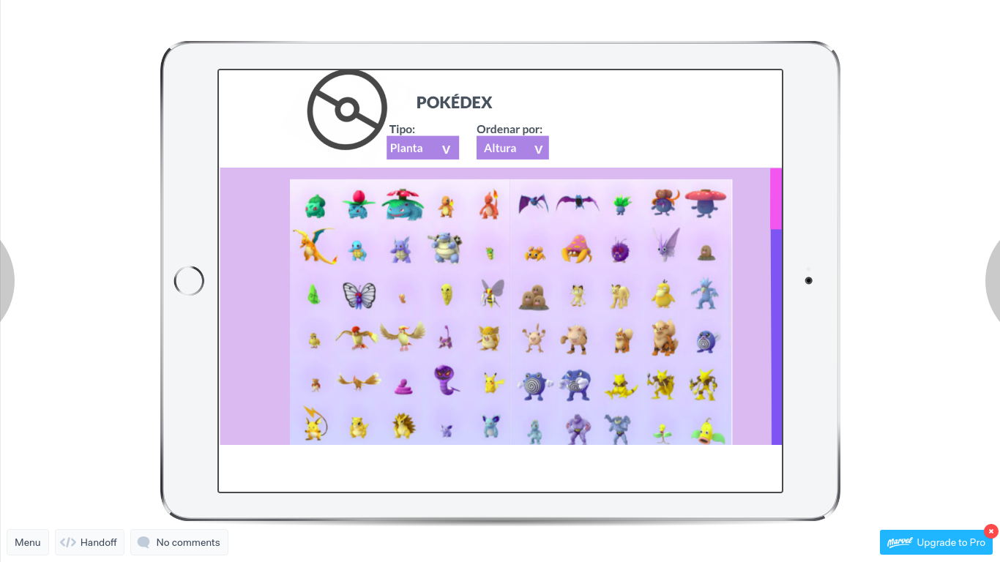
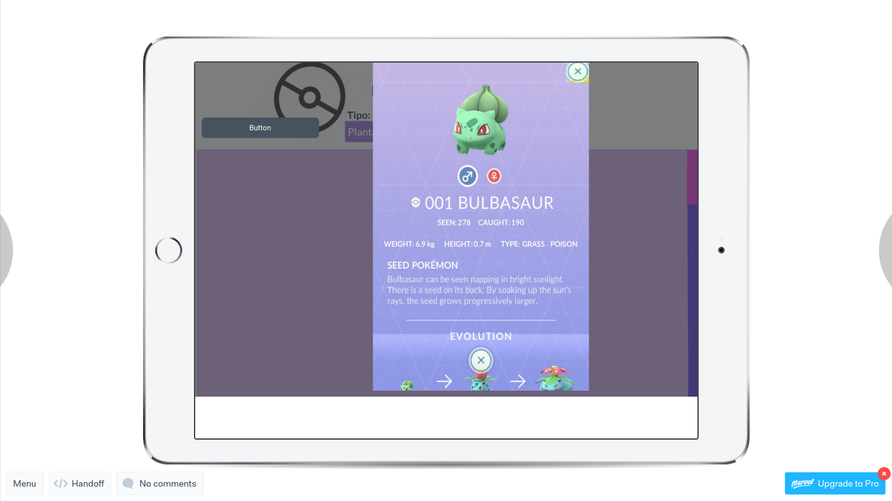
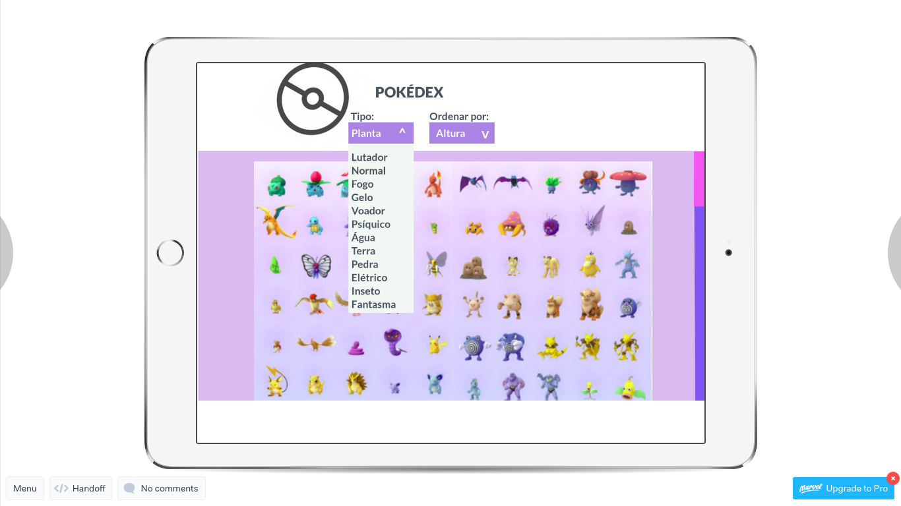

# Data Lovers - Pokémon
Dupla: *Karine Almeida Sooma* & *Janaina Fernandes*

[Link da Aplicação](https://karinesooma.github.io/data-lovers/)

## Índice

* [Definição do produto](#definição-do-produto)
* [Interação com o usuário](#interação-com-o-usuário)
* [Personas](#personas)
* [Protótipo](#protótipo)
* [Testes de usabilidade](#testes-de-usabilidade)

***

### Definição do produto

Pokedex é um site focado nos jogadores do Pokémon GO, onde possibilita filtrar a busca por tipo de pokemon, ordenar por peso, raridade, altura e comparar as características dos pokemons que selecionar.

O objetivo da aplicação é oferecer uma interface divertida, informativa que proporcione ao usuário uma ferramenta de pesquisa e consulta que traga informações relevantes sobre os Pokémons.

### Interação com o usuário

#### Consultar as propriedades de um pokémon

Clicar em sua figura na página inicial. Assim, o usuário poderá consultar a altura, peso, chance de aparecer e as fraquezas do pokémon selecionado.

#### Consultar pokémons de determinado tipo ou mudar sua ordem de apresentação na tela

Clicar nos respectivos menus "TIPO" ou "ORDENAR" de acordo com a opção desejada e selecionar o tipo ou atributo para ordenação.

#### Adicionar pokemons à pokedex

Clicar em "Adicionar à pokedex" para adicionar este pokémon à sua pokédex dentro da janela de atributos do pokemon. Quando um pokémon é adicionado à pokedex fica marcado com uma pokedex no canto superior esquerdo.

#### Remover pokémons da pokédex

Se o pokémon já está em sua pokédex, o botão inferior mostrará "Remover da pokedex". Ao clicá-lo, o usuário remove o pokémon selecionado de sua pokédex.

#### Analisar pokedex

Clicar no símbolo de pokedex no canto superior esquerdo da tela inicial.
ATENÇÃO: Ao analisar a pokedex a mesma não pode ser recuperada posteriormente nessa versão do produto.

#### Sair das janelas abertas

Clicar no "x" no canto superior direito.

### Personas

Depois da Definição do produto, pensamos no usuário, qual o perfil e as necessidades que eles têm que poderíamos ajudar com nosso projeto. Criamos duas personas com perfis diferentes, mas com pontos em comum, gostam de pokemon e gostariam que tivesse algum aplicativo, site sobre as características de pokemons e que pudessem comparar com os que já capturaram ou gostariam de batalhar. 

 

### Desenho da interface de usuário

#### Protótipo
[Link para o primeiro protótipo](https://marvelapp.com/5b67801/screen/54373490)

Criamos o primeiro protótipo no marvel com uma tarefa para o usuário: clicar no Bulbasaur, ler as informações sobre o mesmo na aba que aparece e fechar. 

#### Testes de usabilidade

A partir dos testes de usabilidade, pudemos ver que nossa idéia estava no caminho certo, mas com aspectos que poderíamos melhorar, por exemplo a interface e por sugestão de usuários: implementar uma função para analisar pokemons da escolha do mesmo. 

