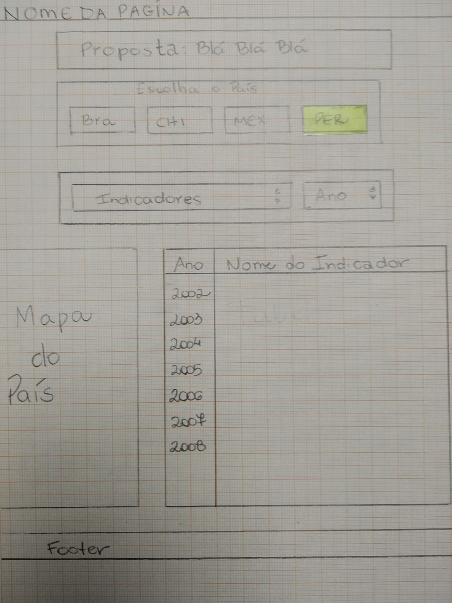
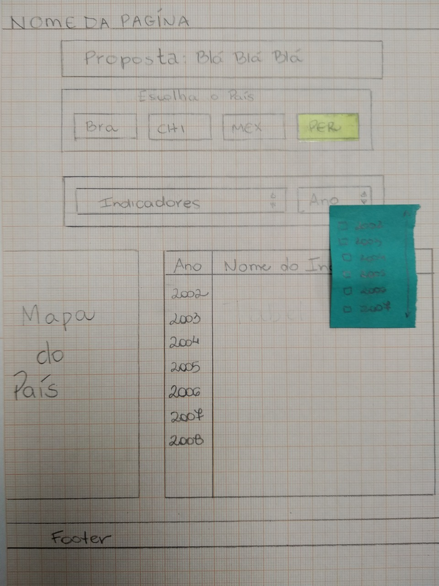

# Data Lovers

## Índice

* [Preâmbulo](#preâmbulo)
* [Descrição](#resumo-do-projeto)
* [Considerações gerais](#considerações-gerais)
* [Objetivos de aprendizagem](#objetivos-de-aprendizagem)
* [Parte obrigatória](#parte-obrigatória)
* [Parte opcional](#parte-opcional-hacker-edition)
* [Considerações técnicas](#considerações-técnicas)
* [Primeiros passos](#primeiros-passos)
* [Conteúdo de referência](#conteúdo-de-referência)
* [Checklist](#checklist)

***

## Preâmbulo

Segundo um [estudo da IBM](https://www-01.ibm.com/common/ssi/cgi-bin/ssialias?htmlfid=WRL12345USEN),
90% dos dados que existem hoje foram criados durante os últimos dois anos.
A cada dia geramos 2,5 trilhões de bytes de dados, uma cifra sem precedentes.
Apesar disso, os dados por sozinhos são de pouca utilidade. Para que essas
grandes quantidades de dados se convertam em **informação** fácil de ler para
os usuários, temos que entendê-los e processá-los. Uma maneira simples
de se fazer isso seria criando _interfaces_ e _visualizações_.
Na seguinte imagem, você pode ver de que forma, com os dados que vemos na parte
esquerda, é possível construir uma interface amigável e legível para o usuário.


Você pode ver os detalhes dos dados neste [link](https://gist.github.com/lalogf/dd4aa3017a9f8aa8f90dfbca382c4dc9#file-student-json)
e a interface construída neste [link](https://app.talento.laboratoria.la/profile/HFOoMpOreBU2psCcjjLg5O2EWEv2).

## Resumo do projeto

Neste projeto **você desenvolverá uma _página web_ para visualizar um
_conjunto (set) de dados_** que se adeque ao que seu usuário necessita.
Fornecemos a vocês uma série de dados de diferentes _temáticas_
para que explore e decida com o que gostaria de trabalhar. Nós elegemos
especificamente estes sets de dados porque acreditamos que se adequem bem a esta
etapa de sua aprendizagem.
Uma vez definida sua área de interesse, entenda quem é seu usuario e o que ele
necessita saber ou ver exatamente; assim já poderá criar uma interface que o
ajude a interagir e entender melhor os dados.
Estes são os dados que propomos:

* [Indicadores de desenvolvimento](src/data/worldbank/worldbank.json):
  Indicadores de desenvolvimento do Banco Mundial de alguns países (Brasil, Chile, México e Peru). Estes dados incluim indicadores
  demográficos, econômicos e comerciais.
* [Pokémon](src/data/pokemon/pokemon.json):
  Neste set você encontrará uma lista com os 151 Pokémons da região de Kanto,
  junto com suas respectivas estatísticas usadas no jogo [Pokémon GO](pokemongolive.com).
* [Steam notícias](src/data/steam/steam.json):
  Lista de notícias relacionadas aos jogos presentes na plataforma [Steam](https://store.steampowered.com/).
* [League of Legends - Challenger leaderboard](src/data/lol/lol.json):
  Este set de dados mostra a lista de jogadores em uma liga do
  jogo League of Legends (LoL). Você pode revisar a documentação de sua API
  neste link [link](https://developer.riotgames.com/api-methods/).
* [Pessoas feridas por meios de transporte nos EUA](src/data/injuries/injuries.json).
  Este set nos mostra o número de pessoas feridas em acidentes em
  meios de transporte, com a data anual desde 1960 e categorizada por
  tipo de transporte (aéreo, barco, automóvel, moto, bicicleta, etc).

Como produto final você terá que criar uma página web que permita **visualizar
os dados, filtrá-los, ordená-los e fazer algum cálculo agregado**. Como esclarecimento,
ao falar de cálculo agregado, nos referimos a diferentes cálculos que se pode fazer
com os dados e trazer informações ainda mais relevantes para o usuário. Uma opção
seriam cálculos estatísticos com média, mínimo e máximo. Por exepmplo, se temos
uma coleção que representa um grupo de pessoas e cada pessoa está representada
com um _objeto_ com uma _propriedade_ `altura`, poderíamos calcular a
altura média em um grupo, entre outras coisas.

Esperamos que cada set de dados esteja acompanhado de uma identidade gráfica
condizente. Você pode pesquisar na internet para ter referências sobre cada um
dos temas e trabalhar em uma identidade para sua página.

## Considerações gerais

* Este projeto deve ser feito em duplas.
* O projeto será entregue através do Github (commit/push) e a
  interface será entregue pelo Github Pages.

## Objetivos de aprendizagem

O objetivo principal deste projeto é que você aprenda a desenvolver
uma interface web onde se possa visualizar e manipular dados, entendendo o
que o usuário necessita.

Falando com mais clareza, você aprenderá a:

* Aplicar e aprofundar tudo o que aprendeu no projeto anterior.
* Pensar nas **necessidades dos usuários** para criar uma interface que faça
  sentido e com tarefas claras.
* Trabalhar com suas definições de pronto (_definition of done_) na organização
  e planificação de seu trabalho.
* Definir os dados e de que forma mostrá-los no produto, baseando-se em seu
  **entendimento de usuário**.
* Criar produtos que sigam os **princípios básicos de usabilidade**.
* Iterar o desenho do produto, baseando-se nos resultados dos
  **testes de usabilidade**.
* Manipular **_arrays_ e _objetos_**.
* **Manipular o DOM** (agregar elementos dinamicamente, baseados nos dados).
* **Manejar eventos do DOM** para permitir interação com o usuário
  (dados filtrados, ordenados, etc).
* Entender os benefícios e complexidades de **trabalhar em equipe** em um
  ambiente de incertezas.

## Parte Obrigatória

Os critérios para considerar que você completou o projeto são:

### Definição do produto

Documente brevemente seu trabalho no arquivo `README.md` de seu repositório,
nos contando como foi seu processo de desenvolvimento do projeto e como
acredita que seu produto resolve o problema (os problemas) do seu usuário.

##### Processo de definição
Escolhemos como tema o "worldbank" e pensamos em quem seria nossos potenciais usuários,chegamos a conclusão de que seriam professores e estudantes de geografia afim de buscar dados para suas aulas e estudos.


### Desenho da interface de usuário

#### Protótipo
Durante seu trabalho você deverá ter feito esboços de sua solução usando papel
e lápis. Recomendamos que você tire fotos de todas as iterações que faça, suba
para seu repositório, e as mencione em seu`README.md`. Caso queira, pode
desenhar protótipos de média fidelidade usando o [Marvel](https://marvelapp.com/)
ou o [Figma](https://www.figma.com/).

###### Desenhos da interface

Desenhamos a interface da seguinte forma:





#### Testes de usabilidade

Durante o desafio você deverá realizar testes de usabilidade com diversos
usuários. Com base nos resultados dos testes, você deverá reorganizar seu
protótipo. Documente as diversas iterações para ter ideia da evolução e para
conseguir resgatar ideias mais tarde.

### Implementação de Interface de Usuário (HTML/CSS/JS)

Logo após desenhar sua interface de usuário você deverá trabalhar em sua
implementação. Como mencionamos, **não** é necessário que desenvolva uma
interface tal como a desenhou. Você terá um tempo limitado para codar, então,
deverá priorizar. Como mínimo, sua implementação deve:

1. Mostrar os dados em uma interface: pode ser um card, uma tabela, uma
   lista, etc.
2. Permitir ao usuário filtrar e ordenar os dados.
3. Calcular estatísticas como média aritmética, máximo e/ou mínimo de algum
   atributo numérico, ou contar quantas vezes aparece um determinado valor,
   por exemplo.

#####Desenvolvimento

Após desenharmos a interface no papel, partimos para colocar a estrutura básica da pagina no html
Com essa estrutura básica, pudemos começar a desenvolver o js de acordo com o fluxo que o usuário deveria seguir para que as informações fossem aparecendo na tela, em um primeiro momento, o usuário acessava a página, encontrava o título, 4 botões com os países disponíveis em nosso banco de dados (Brasil, Chile, México e Peru), ao clicar em um deles, conseguia visualizar os indicadores disponível para a pesquisa.
A seguir, trabalhamos com a exibição dos anos disponóveis para pesquisa após o click no indicador
O desenvolvimento foi feito de forma a disponibilizar apenas as datas que possuíssem valores para consulta, eliminando assim os anos que retornariam vazio
No passo seguinte, trabalhamos com a forma que achamos ser mais fácil e didática de visualizar os dados, um gráfico. Através de um modelo do googlecharts desenvolvemos o nosso gráfico passando as informações requeridas pelo usuario
Por fim, trabalhamos com os ultimos ajustes no CSS para que a pagina ficasse o mais próxima possivel ao que esperavamos ao desenha-la

## Parte Opcional (Hacker edition)

Features/características extras sugeridas:
* No lugar de consumir os dados de forma estática, você pode trabalhar com
  eles de forma dinâmica, carregando um arquivo JSON por meio de um `fetch`.
  A pasta `src/data` contém  uma versão `.js` e uma `.json` de cada set
  de dados.
* Agregar em sua interface de usuário visualizações gráficas. Para isso,
  recomendamos explorar bibliotecas de gráficos como [Chart.js](https://www.chartjs.org/) ou [Google Charts](https://developers.google.com/chart/).

[Vídeo do Dani usando o HighCharts](https://www.youtube.com/watch?v=MTXoCp2D7Ps)
[Vídeo da Ju usando o Google Charts](https://youtu.be/ueixcpZ65oc)

## Considerações técnicas

A lógica do projeto deve estar implementada completamente em JavaScript
(ES6), HTML e CSS. Neste projeto NÃO está permitido usar bibliotecas ou
frameworks, somente [vanilla JavaScript](https://medium.com/laboratoria-how-to/vanillajs-vs-jquery-31e623bbd46e), com exceção das
bibliotecas para fazer gráficos (charts).
Você não deve utilizar a _pseudo-variable_ `this`.
O _boilerplate_ contém uma estrutura de arquivos como ponto de partida
assim como toda configuração de dependências:

```text
.
├── README.md
└──src
    ├── data
    │   ├── injuries
    │   │   ├── injuries.js
    │   │   └── injuries.json
    │   ├── lol
    │   │   ├── lol.js
    │   │   └── lol.json
    │   ├── pokemon
    │   │   ├── pokemon.js
    │   │   └── pokemon.json
    │   ├── steam
    │   │   ├── steam.js
    │   │   └── steam.json
    │   └── worldbank
    │       ├── worldbank.js
    │       └── worldbank.json
    ├── index.html
    ├── main.js
    └── style.css

8 directories, 16 files
```

### `src/index.html`

Assim como no projeto anterior, existe um arquivo `index.html`. Como
você já sabe, aqui vai a página que se mostrará ao usuário. Também nos serve para indicar que scripts serão usados e unir tudo que fizemos.

Neste arquivo você encontrará uma série de _etiquetas_ (_tags_) `<script>`
_comentadas_. Para _carregar_ as diferentes fontes de dados você terá que
_descomentar_ estas _tags_. Cada um destes scripts vai atribuir uma
variável global com os dados correspondentes a essa fonte de dados.

Por exemplo, se descomentamos a seguinte linha:

```html
<!-- <script src="./data/worldbank/worldbank.js"></script> -->
```

A linha ficaria assiim:

```html
<script src="./data/worldbank/worldbank.js"></script>
```

E agora teríamos a variável global `WORLDBANK` disponível em nossos
outros scripts (como `src/data.js` ou `src/main.js`).

### `src/main.js`

Recomendamos usar `src/main.js` para toda a parte do seu código destinada
a mostrar dados na tela. Com isto nos referimos basicamente as manipulações de DOM: operações como criação de nós, registro de manipuladores de eventos (_event listeners_ o _event handlers_), etc.

Esta não é a única forma de dividir seu código. Você pode usar mais arquivos e pastas para que sua estrutura fique clara para suas companheiras.

### `src/data`

Nesta pasta estão os dados das diferentes fontes. Você encontrará uma pasta para cada fonte e dentro de cada pasta dois arquivos: um com a extensão `.js` e outro `.json`. Ambos arquivos contêm os mesmos dados; a diferença é que o `.js` usaremos através de uma tag `<script>`, enquanto
que o `.json` está aí para que você possa, caso queira, carregar os dados de forma assíncrona com [`fetch()`](https://developer.mozilla.org/pt-BR/docs/Web/API/Fetch_API).

## Avaliação

Te aconselhamos revisar [a rúbrica](https://docs.google.com/spreadsheets/d/1hwyBoJWbA0MHGEMDLKqftIv64IhA1uKe2kmJhYpir4s/edit#gid=2045120301)
para ver a descrição detalhada de cada _habilidade_ e cada _nível_.

Esta é uma lista de todas as habilidades que avaliaremos ao final deste projeto:

### Tech

**CS**
Lógica
Arquitetura
Padrões/Paradigmas
**SCM**
Git
GitHub
**JavaScript**
Nomenclatura/semântica
Funções/modularidade
Estruturas de dados
**HTML**
Validação
Semântica
**CSS**
DRY

***

## Dicas de como começar a trabalhar no projeto

Antes de começar a escrever o código, você deve definir o que será feito
com base nos conhecimentos que você possa obter dos usuários do seu
produto. Essas perguntas podem te ajudar:

* Quem são os principais usuários de seu produto?
* Quais são os objetivos de seu usuário com relação ao seu produto?
* Quais os dados mais importantes que eles querem ver em sua interface?
* Quando utilizam ou utilizariam seu produto?

Quando já estiver pronta para codar, te recomendamos começar desta forma:

1. Uma das integrantes da dupla deve realizar um :fork_and_knife:
   [fork](https://help.github.com/articles/fork-a-repo/) do repositório.
   Seus _mentores_ compartilharão um _link_ que te dará acesso ao repo.
   A outra integrante deve fazer um **fork do repositório de sua companheira**
   e trabalharem juntas.
2. :arrow_down: [Clone](https://help.github.com/articles/cloning-a-repository/)
   seu _fork_ para seu computador (cópia local).
3. Let's code! :rocket:

***

## Conteúdo de referência

### Experiência de Usuário (UX Design)

* Entrevistas com usuários
* Princípios de usabilidade

### Desenvolvimento Front-end

* Unidade de arrays no curso de JavaScript no LMS.
* Unidade de objetos no curso de JavaScript no LMS.
* Unidade de funções no curso de JavaScript no LMS.
* Unidade de DOM no curso de Browser JavaScript no LMS.
* [Array no MDN](https://developer.mozilla.org/pt-br/docs/Web/JavaScript/Referencia/Objetos_globales/Array)
* [Array.sort no MDN](https://developer.mozilla.org/pt-br/docs/Web/JavaScript/Referencia/Objetos_globales/Array/sort)
* [Array.map no MDN](https://developer.mozilla.org/pt-br/docs/Web/JavaScript/Referencia/Objetos_globales/Array/map)
* [Array.filter no MDN](https://developer.mozilla.org/pt-br/docs/Web/JavaScript/Referencia/Objetos_globales/Array/filter)
* [Array.reduce no MDN](https://developer.mozilla.org/pt-br/docs/Web/JavaScript/Referencia/Objetos_globales/Array/reduce)
* [Array.forEach no MDN](https://developer.mozilla.org/pt-br/docs/Web/JavaScript/Referencia/Objetos_globales/Array/forEach)
* [Object.keys no MDN](https://developer.mozilla.org/pt-br/docs/Web/JavaScript/Referencia/Objetos_globales/Object/keys)
* [Object.entries no MDN](https://developer.mozilla.org/pt-br/docs/Web/JavaScript/Referencia/Objetos_globales/Object/entries)
* [Fetch API no MDN](https://developer.mozilla.org/pt-br/docs/Web/API/Fetch_API)
* [json.org](https://json.org/json-pt.html)

***

## Checklist

* [ ] Usar VanillaJS.
* [ ] Inclui _Definição de produto_ clara e informativa no `README.md`.
* [ ] Inclui esboço da solução (protótipo de baixa fidelidade e de alta fidelidade, se houver) no
  `README.md`.
* [ ] Inclui a lista de problema detectados através dos testes de usabilidade
  no `README.md`.
* [ ] UI: Mostra lista e/ou tabela com dados e/ou indicadores.
* [ ] UI: Permite ordenar os dados por meio de um ou mais campos
  (asc e desc).
* [ ] UI: Permite filtrar os dados com base em uma condição.